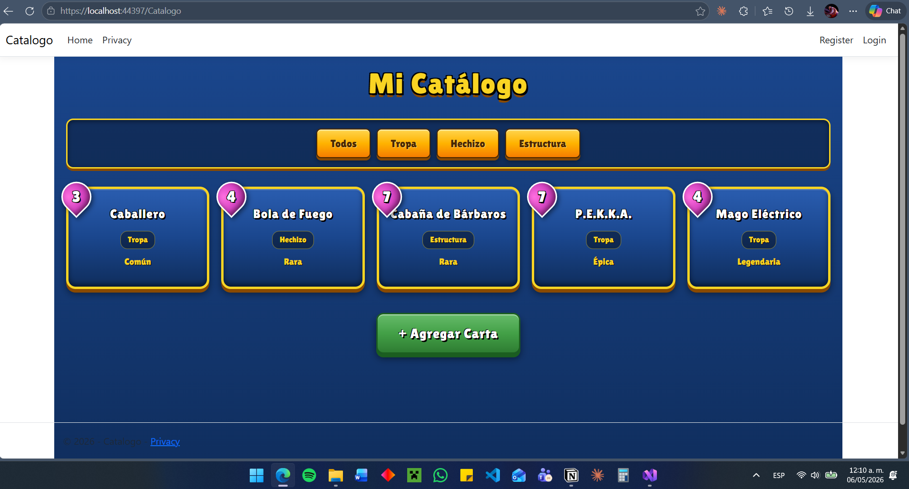
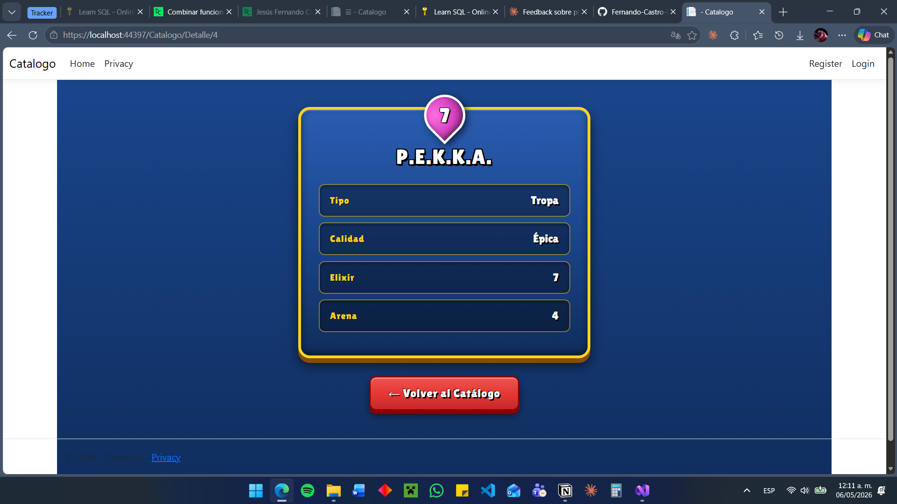
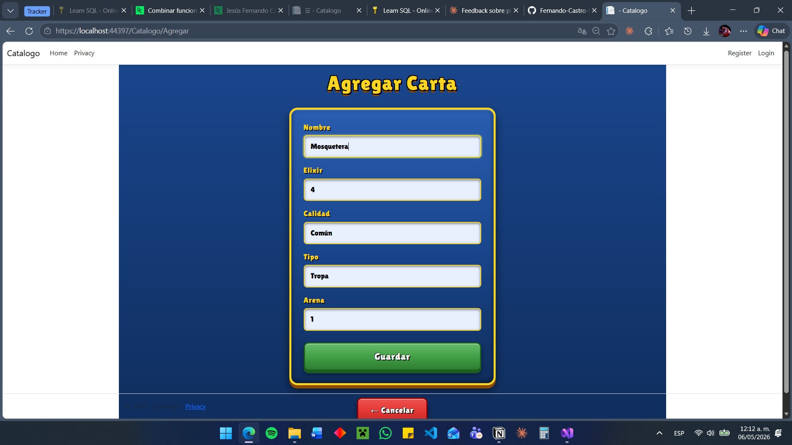

# Catálogo de Cartas de Clash Royale

Aplicación web desarrollada en **ASP.NET Core MVC** como primera práctica de la materia de **Arquitectura de Software** (TSU en Desarrollo e Innovación de Software, 3er Cuatrimestre).

El proyecto es un catálogo personal de cartas de Clash Royale que permite listar, filtrar, ver el detalle y agregar cartas nuevas. El objetivo no es construir una aplicación completa, sino **ver el patrón Modelo-Vista-Controlador funcionando en un caso real** y entender cómo se separan las responsabilidades en una solución de ASP.NET Core.

## Funcionalidades

- Listado de cartas con su nombre, tipo, calidad y costo de elixir.
- Filtrado por tipo de carta: Tropa, Hechizo o Estructura.
- Vista de detalle con todos los atributos de cada carta.
- Formulario para agregar cartas nuevas (los datos se guardan en memoria).
- Interfaz inspirada en la estética visual del juego original.

## Modelo de datos

Cada carta del catálogo (`Item`) tiene los siguientes atributos:

- **Id** — identificador único.
- **Nombre** — nombre de la carta (ej. "Caballero", "P.E.K.K.A.").
- **Elixir** — costo de elixir para invocarla (1–9).
- **Calidad** — Común, Rara, Épica, Legendaria o Campeón.
- **Tipo** — Tropa, Hechizo o Estructura.
- **Arena** — número de arena donde se desbloquea.

## Arquitectura

El proyecto sigue el patrón **MVC**:

- **Models/** — define la entidad `Item` con sus atributos.
- **Controllers/CatalogoController.cs** — orquesta las peticiones HTTP. Contiene los actions `Index`, `Detalle`, `Agregar` (GET) y `Agregar` (POST).
- **Views/Catalogo/** — vistas Razor que renderizan el HTML: `Index.cshtml`, `Detalle.cshtml` y `Agregar.cshtml`.

Los datos están en una lista estática en memoria. No hay base de datos en esta primera versión — se incorporará en prácticas posteriores.

## Tecnologías usadas

- **.NET 10.0** — framework de desarrollo.
- **ASP.NET Core MVC** — framework web.
- **C# 13** — lenguaje de programación.
- **Razor** — motor de vistas.
- **HTML5 / CSS3** — estructura y estilos personalizados.
- **Google Fonts (Lilita One)** — tipografía estilo Supercell.
- **Visual Studio 2026** — IDE.
- **Git / GitHub** — control de versiones.

## Cómo correrlo localmente

1. Clonar el repositorio:
   ```bash
   git clone https://github.com/Fernando-Castro-Hernandez/ArqSoft-S01-Fernando.git
   ```
2. Abrir `Catalogo.slnx` en Visual Studio.
3. Restaurar paquetes NuGet (Visual Studio lo hace automáticamente al abrir la solución).
4. Presionar `F5` para correr la aplicación.
5. En el navegador, navegar a `https://localhost:7216/Catalogo`.

## Capturas de pantalla

### Listado de cartas con filtro por tipo


### Vista de detalle


### Formulario para agregar carta


## Estructura del repositorio

```
Catalogo/
├── Controllers/
│   ├── CatalogoController.cs
│   └── HomeController.cs
├── Models/
│   ├── Items.cs
│   └── ErrorViewModel.cs
├── Views/
│   ├── Catalogo/
│   │   ├── Index.cshtml
│   │   ├── Detalle.cshtml
│   │   └── Agregar.cshtml
│   ├── Home/
│   └── Shared/
├── wwwroot/
│   └── css/
│       └── site.css
├── docs/
│   └── screenshots/
├── Program.cs
├── Catalogo.csproj
└── README.md
```

## Autor

**Fernando** — TSU en Desarrollo e Innovación de Software, 3er Cuatrimestre.
Materia: Arquitectura de Software · Mayo–Agosto 2026.
Profesor: Dr. Jorge Javier Pedrozo Romero.